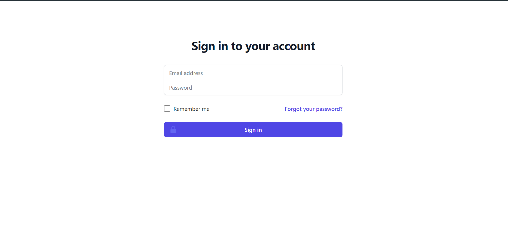
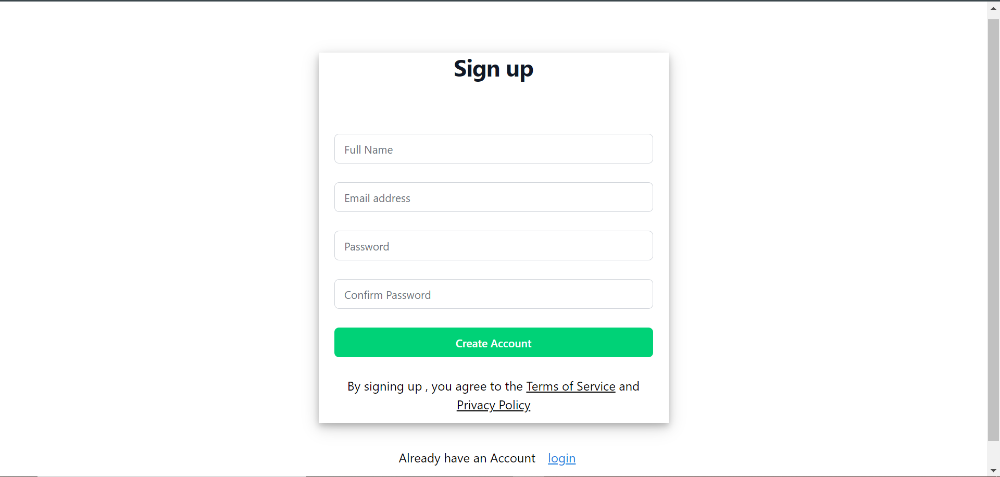
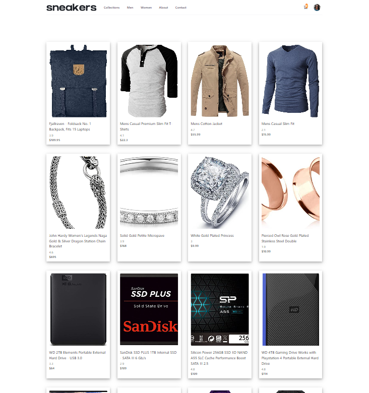
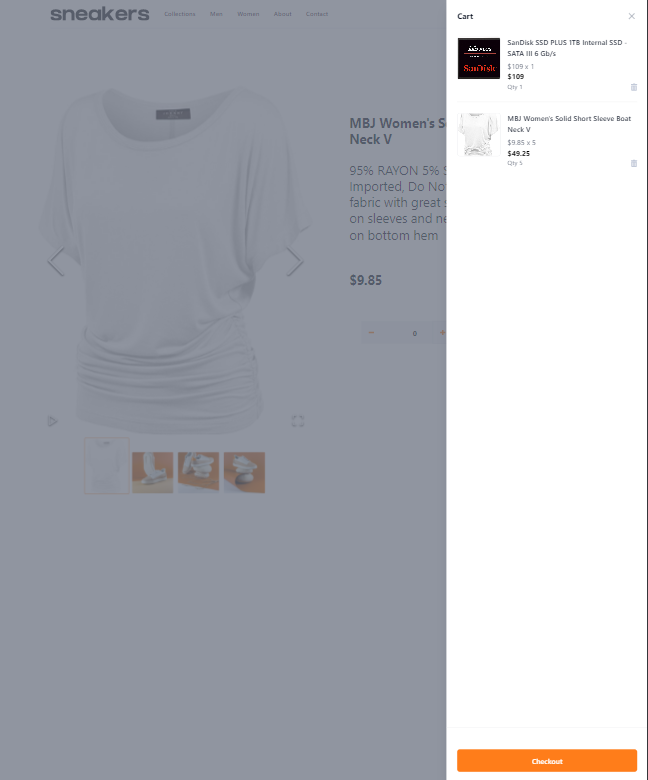

#  E-commerce product page solution

This is a submission to the Fast Track Final Project

## Table of contents

- [Overview](#overview)
  - [The challenge](#the-challenge)
  - [Screenshot](#screenshot)
- [My process](#my-process)
  - [Built with](#built-with)
  - [What I learned](#what-i-learned)
  - [Continued development](#continued-development)
  - [Useful resources](#useful-resources)

## Overview
## the-challenge
### User Capabilities

Users should be able to:

- View the optimal layout for the site depending on their device's screen size
- See hover states for all interactive elements on the page
- Open an image gallery by clicking on the full screen icon
- Switch the large product image by clicking on the small thumbnail images
- Add items to the cart
- View the cart and remove items from it

### Screenshot

# my-process
## Stack

### Built with

- Semantic HTML5 markup
- CSS custom properties
- Flexbox
- CSS Grid
- Mobile-first workflow
- [React](https://reactjs.org/) - JS library
- [Tailwind](https://tailwindui.com/) - For styles

### Commands needed to run your porjects
#### npm :  npm start

### what-i-learned
### continued-development
### Useful resources

- [resource 1](https://codesandbox.io/s/github/reduxjs/redux/tree/master/examples/counter-ts?from-embed=&file=/src/features/counter/counterSlice.ts:2591-2661) - This helped me use Redux toolkit with typescript.
